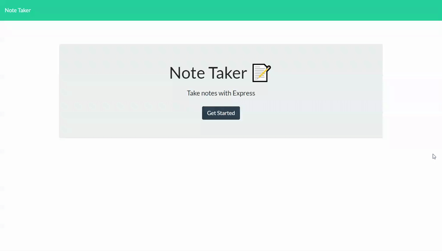

# Note Taker
​
## Table of contents
​
- [Overview](#overview)
  - [The challenge](#the-challenge)
  - [User Story](#user-story)
  - [Acceptance Criteria](#acceptance-criteria)
  - [Application GIF](#application-gif)
  - [Links](#links)
- [My process](#my-process)
  - [Built with](#built-with)
  - [What I learned](#what-i-learned)
  - [Continued development](#continued-development)
  - [Useful resources](#useful-resources)
- [Author](#author)
- [Acknowledgments](#acknowledgments)
​
​
## Overview
​
### The challenge
​
This challenged required developing a backend for an application that already has fully developed front end code.  The Note Taker application is a fullstack NodeJS application that is deployed on Heroku.  The application has a sleek UI that users can easily interact with to create, view, save, and delete notes.  The application features data persistance and will save notes added by the user to a database JSON file.  The user can also delete notes that have been saved.
​
### User Story
​
```md
AS A small business owner
I WANT to be able to write and save notes
SO THAT I can organize my thoughts and keep track of tasks I need to complete
```
​
### Acceptance Criteria
​
```md
GIVEN a note-taking application
WHEN I open the Note Taker
THEN I am presented with a landing page with a link to a notes page
WHEN I click on the link to the notes page
THEN I am presented with a page with existing notes listed in the left-hand column, plus empty fields to enter a new note title and the note’s text in the right-hand column
WHEN I enter a new note title and the note’s text
THEN a Save icon appears in the navigation at the top of the page
WHEN I click on the Save icon
THEN the new note I have entered is saved and appears in the left-hand column with the other existing notes
WHEN I click on an existing note in the list in the left-hand column
THEN that note appears in the right-hand column
WHEN I click on the Write icon in the navigation at the top of the page
THEN I am presented with empty fields to enter a new note title and the note’s text in the right-hand column
```

​
### Application GIF

<br>


​
​
### Links

- Deployed Application: [https://nolans-note-taker.herokuapp.com/](https://nolans-note-taker.herokuapp.com/)

<br>

## My process
​
### Built with
​
- JavaScript
- NodeJS
- CSS
- NPM fs
- ExpressJS
- Heroku
​
### What I learned
​
The Note Taker application challenged me to develop a back end to suit the needs of an existing front end code.  I learned how to understand the logic and needs of the existing code in order to develop the back end efficiently to mesh with the front end code.  One challenge I encountered while writing my code was how to write a route for a delete request with an ID query parameter.  The route setup was easy but I had to research how to get and use the query parameter from the delete request.  Below is a section of the block of code for the controller function for the delete route:

```js
const deleteNote = (req, res) => {
    // get the note ID from req body
    const { id } = req.params;

    // Read the database file and store in notes
    const notes = JSON.parse(fs.readFileSync(path.join(__dirname, '../db/db.json'), 'utf8', (err, data) => {
        if (err) {
            return res.status(400).json({ err });
        }
        return data;
    }));
    // remove note by id from notes array
    // save specific note for success log
    let deletedNote;
    notes.forEach((note, index) => {
        if (note.id === id) {
            deletedNote = note;
            notes.splice(index, 1);
            return
        }
    });

    fs.writeFile(path.join(__dirname, '../db/db.json'), JSON.stringify(notes), (err) => {
        if (err) {
            return res.status(400).json({ err });
        }
        else {
            const response = {
                status: 'success',
                body: deletedNote,
            };
        
            res.json(response);
        }
    });
}
```

As seen above, I learned that query parameters are saved in the request body, specifically under the `params` key.  After learning this, I destructured the params key object for the id value.  I was able to use this to successfully loop through the notes array to find the note with the matching ID to delete it.  I also decided to return a response object with the success message and the corresponding note that was deleted.

Another thing to note, I utilized `fs.readFileSync` in this block of code.  I wanted to make sure that the read file was completed before moving on to the next part of code to avoid errors.  I am going to research more about using utils.promisfy or other alternatives and which method is best in specific situations.
​
### Continued development
​
This project showed me an introduction to deploying a full stack web application to Heroku.  For this first time ever, I was able to create a hosted application that has data persistance in a database, albeit a json file instead of a separate database.  In the future, it would be fun to create user accounts with login verification so that many users can use the application with their unique data displayed to interact with.

In addition, it would be fun to revisit my word game project to convert it to a full stack applicaton instead of having it run purely off of the front end.
​
### Useful resources
​
- [Heroku Deployment Guide](https://devcenter.heroku.com/articles/git) - This is Heroku's documentation on how to easily deploy a new application on their platform; it was concise and helpful for me to get my application deployed.
- [UUID Docs](https://github.com/uuidjs/uuid#readme) - This is the Github for the npm UUID module.  I used this documentation to learn how to get unique id's generated for my applications note objects.
- [Expressjs Routing Docs](https://expressjs.com/en/guide/routing.html) - A great reference for setting up all types of routes in an Expressjs application; it was of great help for setting up my routes with an ID parameter.
​
## Author
​
Nolan Spence
- Website - [Nolan Spence](https://unicorn-barf.github.io/Portfolio_Website_HTML_CSS/)
- LinkedIn - [https://www.linkedin.com/in/aerospence/](https://www.linkedin.com/in/aerospence/)
​
## Acknowledgments
​

